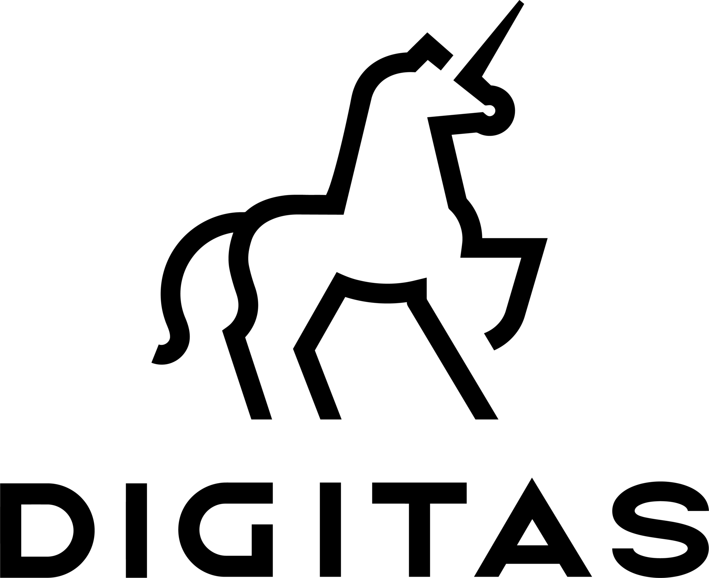

# Welcome to theDataStrategist

Hi, I'm Gordon Silvera — a freelance data science consultant helping startups and enterprise companies turn data into action.

)

 

## Services

  
<b> Freelance Data Science</b>

  I've worked as a data scientist for companies including 
  
   
  <b>Senior Data Scientist</b> @ Spotify  
  
   
  <b>Senior Product Scientist</b> @ Indeed  
  
   
  <b>Data Science Consultant</b> @ Cirkul  
  
   
  <b>Data Scientist</b> @ Digitas  

  
<b> Dashboard Development</b>

  We will build and maintain custom dashboards for your organization
  - Example 1
  - Example 2
  - Example 3

  
<b> Data Pipeline Development</b>

  We will build and maintain data pipelines for your organization
  - Example 1
  - Example 2
  - Example 3

 

## Featured Projects

  
<b>TheLook: eCommerce Dashboard Development</b>

   
  
  We build data pipelines and dashboards using best-in-class services such as Fivetran, Google BigQuery, dbt, and Looker. 
  We combine this with strategic frameworks to ensure the data, metrics, and dashboards are properly understood across the business.
  
  In this project, we use data from a fictitious e-commerce company, TheLook, to build the technical and strategic components below. 
  The source data are publicly available from Google.

  __Deliverables__ 
  - [Project Brief | Google Sheets](https://docs.google.com/document/d/1lKgfRu8e3j__711EazlMn1VUS68wOilqYVmDALAmbTQ/edit?usp=sharing). A summary of the work to complete. I create a project brief for every project.
  - [Company Metrics Dashboard | Looker Studio](https://lookerstudio.google.com/reporting/44a538de-96fc-4af6-a534-33f5090634b3). A simple executive summary for business performance.
  - [Data Pipeline | dbt + BigQuery](https://github.com/the-datastrategist/thelook-ecommerce). The data pipeline that sources the Company Metrics Dashboard.
  - [Dashboard Design | Figma](https://www.figma.com/design/vYJqKy7vMKfDc5Kr8rZAkN/tDS-%7C-Dashboard-Design-Template?node-id=0-1&p=f). Before the build, we can design your dashboard.
  - [Data Catalog | Google Sheets](https://docs.google.com/spreadsheets/d/1mhPl2p2TV6lHnVCt50jer-9SrDpR4ChXdnThSBOyMbI/edit?gid=2036193832#gid=2036193832). This simple Data Catalog will help us track, understand, and communicate your data from where it's sourced until when it's used.

   

  

  __TODO__
  - Improve dashboard image
  - Add links to deliverables
  - Complete Company Metrics dashboard
  - Improve visualizations in Company Metrics dashboard
  - Move dbt pipeline to poetry

   

  
<b> "The Most Python" Report</b>

  I analyzed 200K IPython notebooks and 2M+ StackOverview posts to identify Python's most common code, libraries, and questions.

  __Deliverables__
  - [The Top 10 Python Functions used by Data Scientists | Medium](https://thedatastrategist.medium.com/what-are-pythons-most-used-functions-d760dc28fd96)
  - [Dashboard | Looker Studio](https://lookerstudio.google.com/reporting/a5096f7e-26c8-48f7-a496-da1fdef6b008). Dashboard containing basic insights on Python usage.
  - [the-most-python | Github](https://github.com/the-datastrategist/the_most_python) This repo uses dbt to manage the data pipelines.

 

## Templates

I use the following templates to reduce the time-to-impact for data science projects.
- [python-library-template](https://github.com/the-datastrategist/python-library-template)
- [tds-library-template](https://github.com/the-datastrategist/tds-library-template)
- [tds-dbt-template](https://github.com/the-datastrategist/tds-dbt-template)
- [tds-streamlit-template](https://github.com/the-datastrategist/tds-streamlit-template)

These templates allow us to:
- Set up projects quickly
- Share work easily
- Productionalize notebook code (almost) instantly

 

__TODO:__
- Build unfinished templates
- Add relevant utils to each template
- Add README to each template

 

## Toolkit

I focus on [Google Cloud Platform](https://cloud.google.com/) but can work with any data stack.

- __Code__ | Python · SQL
- __Stats & ML__ | Scikit-learn
- __Databases__ | BigQuery · dbt
- __Orchestration__ | Airflow · Prefect · dbt · MarvinAI
- __DevOps__ | Docker · poetry · GitHub Actions
- __Dashboards & Reporting__ | Looker · Tableau · Retool · Streamlit

 

## Let’s Work Together

I’m open to new consulting projects.
You can reach me at [gordon@thedatastrategist.com](mailto:gordon@thedatastrategist.com) or on [Upwork](https://www.upwork.com/freelancers/thedatastrategist).

👉 [Schedule a Call](https://calendly.com/gordon-silvera/thedatastrategist-initial-meeting) or see more at
[thedatastrategist.com](https://www.thedatastrategist.com).
